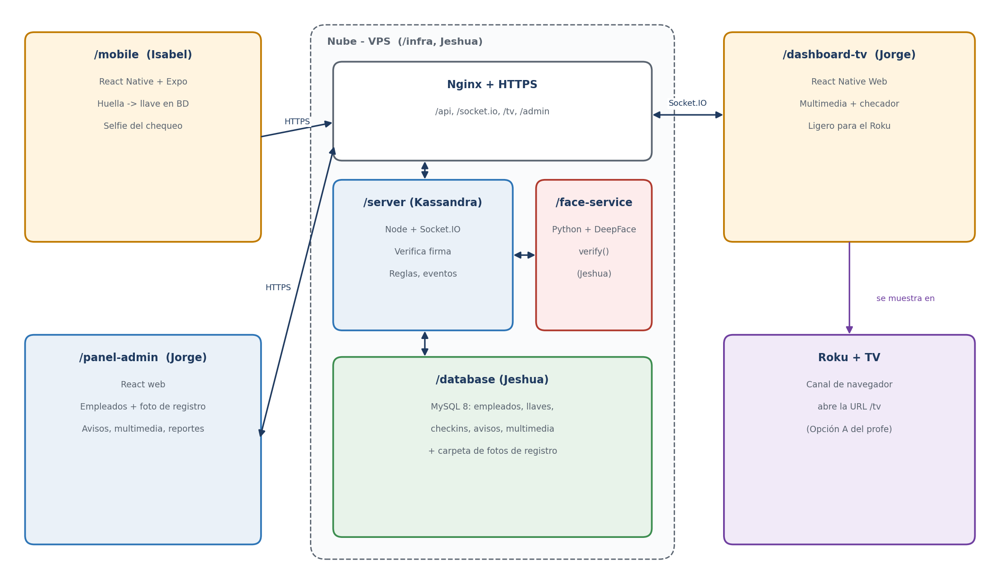
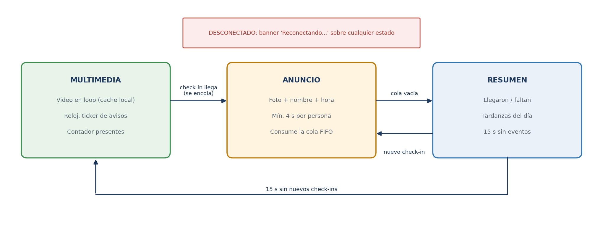

# Arquitectura

## Componentes

| Carpeta | Dueño | Tecnología | Función |
|---|---|---|---|
| `/mobile` | Isabel Celis | React Native + Expo, react-native-biometrics | Registro (código + huella + foto) y check-in (huella + selfie) |
| `/server` | Kassandra Cuadras | Node.js + Express + Socket.IO + mysql2 | API, verificación de firma, reglas, eventos |
| `/dashboard-tv` | Jorge Ramírez | React + Vite | Pantalla del Roku (navegador): multimedia + checador |
| `/panel-admin` | Jorge Ramírez | React + Vite + React Router | Gestión remota |
| `/database` | Jeshua E. Pérez | MySQL 8 | Esquema y datos semilla |
| `/face-service` | Jeshua E. Pérez | Python + FastAPI + DeepFace | Compara foto de registro con selfie |
| `/infra` | Jeshua E. Pérez | Nginx, PM2, Certbot, ufw | Publicación con HTTPS y backups |

## Roles

| Rol | Entra por | Puede |
|---|---|---|
| Admin | Panel web | Todo, incluido registrar usuarios del panel y empleados, generar códigos de registro y desactivar |
| Supervisor | Panel web | Lo mismo que el admin, excepto crear, registrar o desactivar usuarios y empleados |
| Empleado | App móvil (huella + rostro) | Hacer check-in y ver su propio dashboard ("Mi asistencia") |

Detalle de permisos por endpoint en [api.md](api.md).

## Decisiones confirmadas por el profesor

1. **Pantalla:** Opción A. La app web se abre en el navegador del Roku (`/tv/?token=...`).
2. **Huella:** se toma como un dato ligado al usuario en la BD. Como el teléfono no entrega la huella,
   el dato es la **llave pública** que el teléfono crea y protege con la huella (`react-native-biometrics`).
3. **Rostro:** sin trabajar con vectores. `DeepFace.verify(foto_registro, selfie)` responde si es la misma persona.

## Flujo de registro (una vez)

1. Admin genera código de 6 dígitos en el panel.
2. App: código -> `createKeys()` -> llave pública a `POST /api/biometria/registrar`.
3. App: foto de registro -> `POST /api/empleados/foto-registro` (el face-service valida que haya un rostro).

## Flujo de check-in

1. App pide reto (`GET /api/checkin/reto`).
2. Huella firma el reto (`createSignature`).
3. Selfie comprimida -> `POST /api/checkin`.
4. Servidor: verifica firma (identifica al usuario) -> DeepFace compara con su foto (1 a 1) -> reglas -> guarda.
5. Evento `nuevo-checkin` a la sala `tv` -> el Roku muestra foto, nombre y hora.

## Seguridad mínima

- Endpoints protegidos por tipo de acceso (ver `api.md`); nada sensible es público.
- Retos de un solo uso (60 s) e `idempotencyKey` por intento.
- Fotos de registro nunca se sirven por HTTP; selfies solo con token de TV o admin.
- face-service y MySQL solo en red interna.
- JWT del panel en memoria, no en localStorage.
